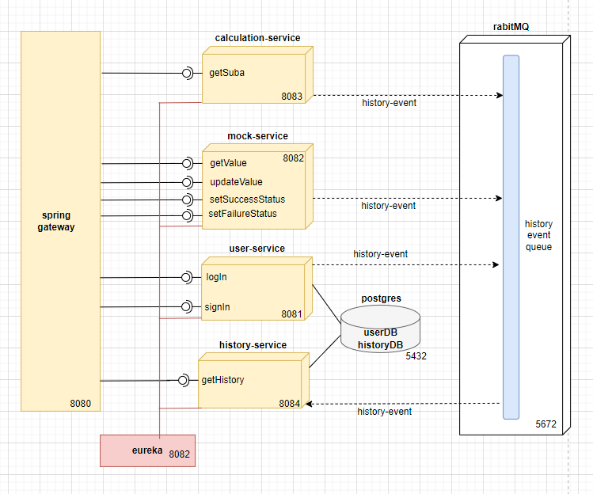
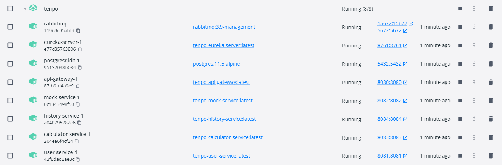
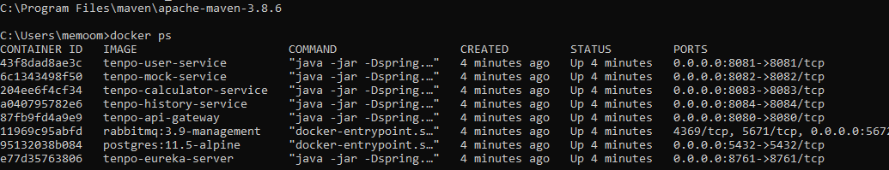
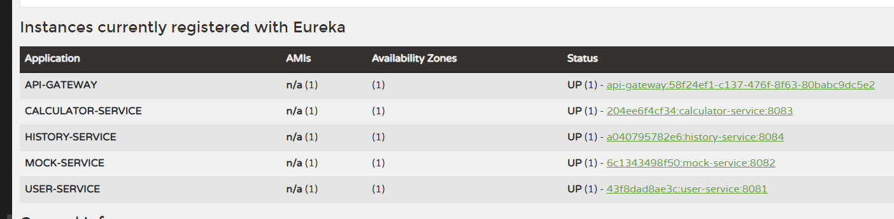
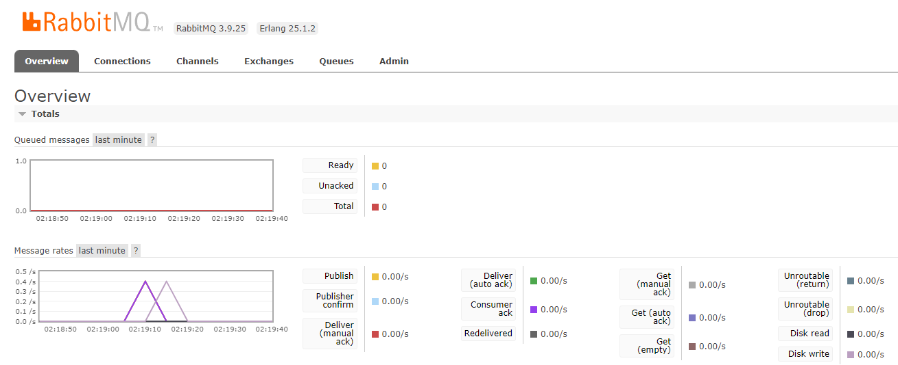

# SOLUCION - PRUEBA TECNICA TENPO
#### Por: Guillermo Andres De Mendoza Corrales, memoodm@gmail.com


# 1. Arquitectura de la solucion:



Principalmente la solucion al desafio fue dividia en 4 servicios independientes, los cuales son: 

| Servicio | Descripcion |
| ------ | ----------- |
| calculation-service   | Calcula el precio final al aplicar una suba, valor obtenido del servicio mock-service |
| mock-service | Es el servicio externo de la prueba, el cual entrega un valor de punto decimal el cual puede ser actualizado por endpoint o forzar a arrojar fallos segun sea necesario, esto para validar la funcionalidad de reintentos de calculation-service |
| user-service    | Permite hacer login y signin de usuarios |
| history-service    | Permite almacenar las trazas de llamados http de cada servicio |

Se implemeta una cola de mensajeria mendiante RabbitMq, con el fin de centralizar y procesar los eventos rest http de los 3 servicios: calculation, mock y user (Producers) de forma controlada por history-service (Consumer)

Adicionalmente se implementa en la solucion el servidor de registro eureka y el api-gateway de spring, lo cual brinda una solucion mas ordenada y mejora la integracion entre los diferentes servicios


# 2. Estructura de los servicios:

En cada servicio, se encontraran los siguientes modulos:

+ DOMAIN-service-dto: contiene los objetos que comparte este servicio

+ DOMAIN-service-web: contiene los clientes que otros servicios pueden utilizar para hacer llamados a este dominio
  
+ DOMAIN-service-application: contiene el proyecto spring-boot, el cual sera el servicio a desplegar, contiendo la logica de negocio, controladores, persitencia ... etc


# 3. Requerimientos tecnicos:

Para ejecutar este proyecto se requieren tener instaladas las siguientes tecnologias:

+ JAVA 11+
+ Maven
+ Python
+ Docker

Adicionalmente se requieren tener las siguientes variables de entorno configuradas:

+ JAVA_HOME: debe apuntar al jdk11
+ M2_HOME: debe apuntar a la carpeta donde tengamos maven
+ Path: debe tener en su lista de direcciones el /bin de maven, java y docker

# 4. Ejecutar el proyecto

### 4.1 Compilar proyectos

Para este paso se debe correr el script de python el cual tiene como nombre: setup.py el cual realizara la ejecucion de cada comando mvn en el profile de docker. De esta forma generando los .jar de cada proyecto

```
python setup.py
```

tiempo de ejecucion aproximado: 1-2 minutos

### 4.2 Dockerizar

Para esto ejecutar el archivo docker-compose.yml, el cual realizara la ejecucion de los comandos necesarios y las ejeciciones de los diferetes archivos Docker de cada proyecto, facilitanto implementar esta en docker, y ejecutando el perfil de Docker en cada proyecto spring, ya que las urls cambian al ejecutarlo local vs en la red de docker.

```
docker-compose up -d
```

tiempo de ejecucion aproximado: 2-3 minutos

### 4.3 Verificar Docker

Si se tiene docker desktop instalado, se deben visualizar todos los contenedores en esta 'Running'



De igual forma se pueden visualizar estos al ejecutar el comando 'docker ps'



### 4.3 Verificar Eureka

Es posible visualizar el estado de cada servicio desde la aplicacion de eureka, mediante la siguiente url en el navegador

```
URL: http://localhost:8761/
```


### 4.3 Verificar RabbitMq

Es posible hacer monitoreo del estado de la cola de mensajeria de rabbitmq, mediante la siguiente url en el navegador

```
URL: http://localhost:15672/

Usuario: guest
Password: guest
```



# 5 Pruebas

Se comparten dos archivos de colecciones de postman

+ tenpo-test-apigateway.postman_collection: apunta al api-gateway puerto 8080
+ tenpo-test-direct.postman_collection: apunta directamente al puerto de cada servicio

Se comparten las dos colecciones, ya que en ocaciones el apigateway se demora un poco en estabilizarse, arrojamdo errores cuando los servicios ya se encuentran listos para ser usados